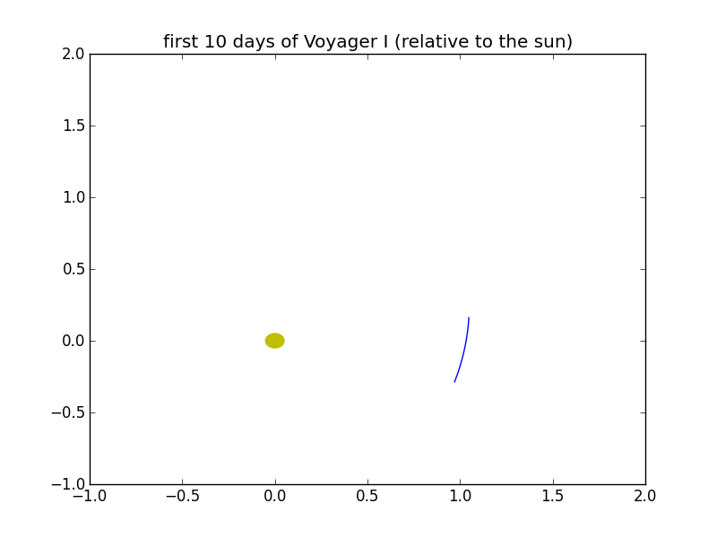

Tutorial
========

This page provides some examples of using py-NASA-horizon. It can be used
as a tutorial or as a cookbook. To find out the ID of the object you want
to query, please consult the :doc:`major_body_sheet`. In general, the
interval size is one day, the measurement unit is AU-D without any
corrections, and the sun is the center of the coordinate system.

Getting location of an object at a certain date
-----------------------------------------------
To query one just one day, set start and end to the same date. This example
uses Mercury as the target object and 2013-01-01 as date.

>>> import datetime
>>> from NASAhorizons import NASAhorizons
>>> # query position of Mercury for January 1st 2013
>>> jpl = NASAhorizons()
>>> jpl.set_object_id(199)
>>> qdate = datetime.date(year=1977, month=1, day=1)
>>> print(jpl.get_data(qdate, qdate))
[{'date': '1977-01-01T00:00:00.0000', 'z': 0.01562549439448472, 'x': 0.09117860868439513, 'y': 0.2894764150799116}]

Plot path of a spacecraft
-------------------------
`Matplotlib <matplotlib.org/>`_ can be used to plot the path of a spacecraft.
Here we plot the path of Voyager I for its first 20 days relative to the sun.

>>> import datetime
>>> from NASAhorizons import NASAhorizons
>>> import matplotlib.pyplot as plt
>>> # query first 20 days of Voyager I relative to the sun
>>> jpl = NASAhorizons()
>>> jpl.set_object_id(-31)
>>> start = datetime.date(year=1977, month=9, day=6)
>>> end = datetime.date(year=1977, month=9, day=26)
>>> alldata = jpl.get_data(start, end, format="list")
>>> xdata = []
>>> ydata = []
>>> for pos in alldata:
>>>     xdata.append(pos['x'])
>>>     ydata.append(pos['y'])
>>> # plot data 
>>> plt.title('first 20 days of Voyager I')
>>> plt.plot(xdata, ydata)
>>> plt.axis([-1,2,-1,2])
>>> sun = plt.Circle((0,0), 0.05,color='y')
>>> fig = plt.gcf()
>>> fig.gca().add_artist(sun)
>>> fig.show()

The result lookslike this:

